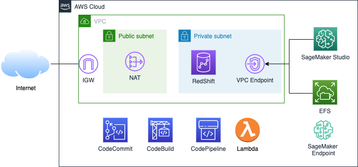
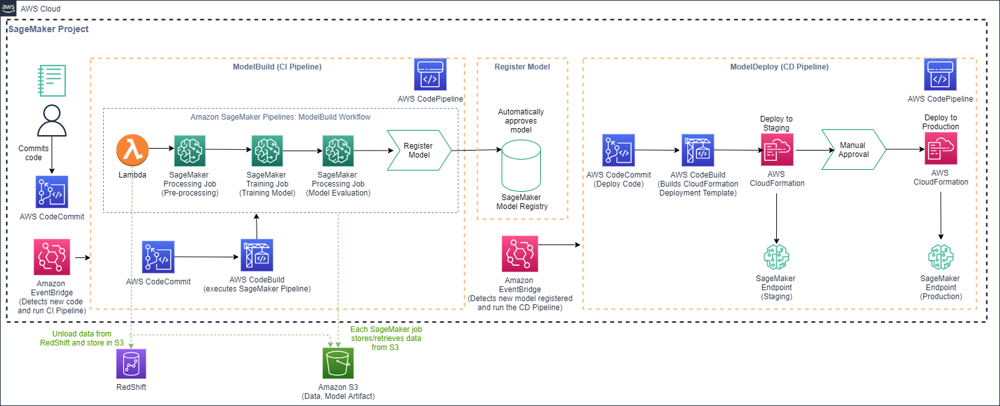
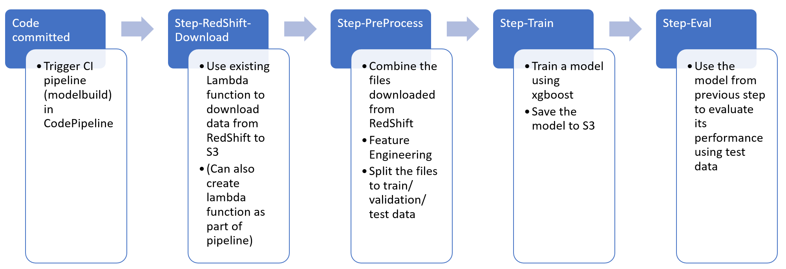
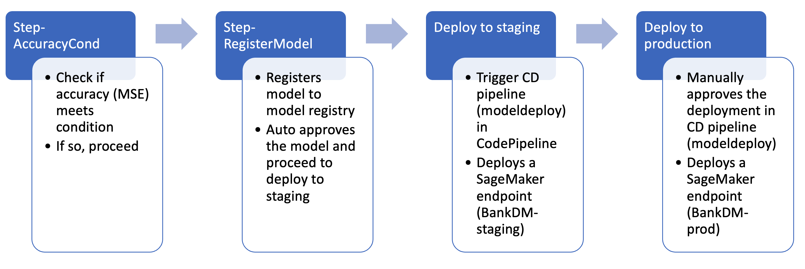

## Purpose
The purpose of this repo is to provide sample codes to create a demo to illustrate MLOps with the data source coming from RedShift. RedShift ML is also demostrated.

Disclaimer: The focus of this demo is to showcase the above and for simplicity, full IAM permissions are assigned. In production setting, best practices like least IAM permission should be used instead.  

## Steps prior to running the notebooks
- Create a new VPC.
- SageMaker Studio to be created and attached to the VPC (not the default option). 
- Add IAM role to SageMaker role.
- Git clone this repo.
- Create a SageMaker project for building, training and deployment. Instructions are at https://sagemaker-immersionday.workshop.aws/en/lab6.html
- Overwrite the files from this repo to the modelbuild repo.

Detailed instructions are located at **instructions.md**

## High level description of the demo
Note: Please complete the steps above first.

1. Create the necessary IAM roles and policies. (Notebook 01)
2. Create secret in RedShift cluster, Secret Manager and Lambda function. (Notebook 01)
3. Explore the data (optional). (Notebook 02)
4. Copy the csv file to S3, create and load the csv data to Athena. (Notebook 03)
5. Create RedShift schema and table. Insert csv data to RedShift using Athena. (Notebook 03)
6. Commit the notebook files to CodeCommit to trigger the CI CodePipeline to run.
7. Once the staging SageMaker endpoint has been created, run predictions to the endpoint. (Notebook 04)
8. You can also use RedShift ML to create a model directly in RedShift using SQL statements. This leverages on SageMaker AutoPilot to create another model (different from the staging SageMaker endpoint). (Notebook 05)
9. Predictions can also be done directly in RedShift using SQL statements to the RedShift ML model. For this demo, SQL statements are provided in the notebook but you can also run the same in the RedShift query editer. (Notebook 05)

## Architecture diagram 

The following diagram shows the architecture for the setup (excluding SageMaker Pipelines)

## MLOps Flow

The following diagram shows the architecture for the MLOps

The steps for the SageMaker Pipelines is as follows

## Roles
There are four roles used in this demo:
- SageMaker Execution role: For SageMaker Studio to create/access resources
- RedShift role (BankDM-RedShift): For RedShift cluster to access resources and for unloading from RedShift to S3
- Lambda execution role (BankDM-Lambda): For Lambda function to access resources
- AmazonSageMakerServiceCatalogProductsUseRole (Default role): For SageMaker Pipelines to create/access resources

## Notes
- If the secret already exists and you are creating the RedShift cluster again in notebook 01, the secret will not be updated to the new password. Please update the password manually in Secrets Manager. This is to prevent accidential update of the secret when you rerun the notebook while the RedShift cluster is still running. 
- The Security Group used for the RedShift and SageMaker Studio is the default one. If you are using another security group, please change the security_group_id in notebook 01.
- If you change any names such as role name, you may have to edit the SageMaker Pipelines code under 'pipelines/bankdm'.

## Clean up
Notebook 06 will clean up most of the resources created automatically. Other areas to delete manually are:
- SageMaker Studio
- S3 buckets
- VPC
- EFS used by SageMaker Studio
- Resources created by SageMaker Pipelines like SageMaker Project. CLI has to be used to delete SageMaker Project which in turns deletes the CodePipeline (aws sagemaker delete-project --project-name BankDM)

## To-do
- Error handling
- Feature store?

## Reference
Some codes were taken from the following sources and edited from there:
- https://github.com/data-science-on-aws/workshop
- https://github.com/aws-samples/amazon-sagemaker-immersion-day
- https://aws.amazon.com/blogs/aws/amazon-redshift-ml-is-now-generally-available-use-sql-to-create-machine-learning-models-and-make-predictions-from-your-data/
- https://github.com/aws/amazon-sagemaker-examples/tree/master/sagemaker-pipelines/tabular/lambda-step