# Detailed instructions for setting up the environment

Note: This guide will setup a new VPC with a private and public subnet.

## Content
- [CloudFormation](#CloudFormation)
- [Launch SageMaker Studio](#Launch-SageMaker-Studio)
- [Assign IAM permission](#Assign-IAM-permission)
- [Create SageMaker Studio user](#Create-SageMaker-Studio-user)
- [SageMaker Studio](#SageMaker-Studio)

## CloudFormation
CloudFormation is used to deploy the a new VPC and SageMaker Studio

- Login to your AWS management console and go to CloudFormation.
- On the left side, click on `Stacks`.
- At the right side, click on `Create stack`, then `With new resources (standard)`.

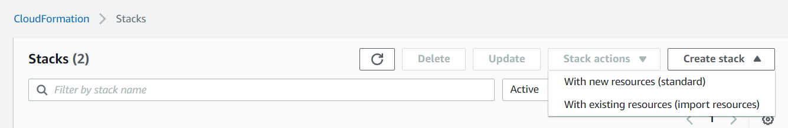

- Under `Specify template`, select `Upload a template file`. Choose the `bankdm-cloudformation.yaml` file.
- Click `Next`.

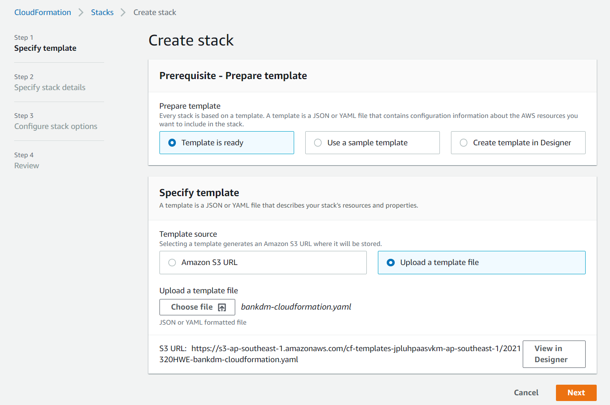

- Enter a stack name (`bankdm` in the screenshot).
- Click `Next`.

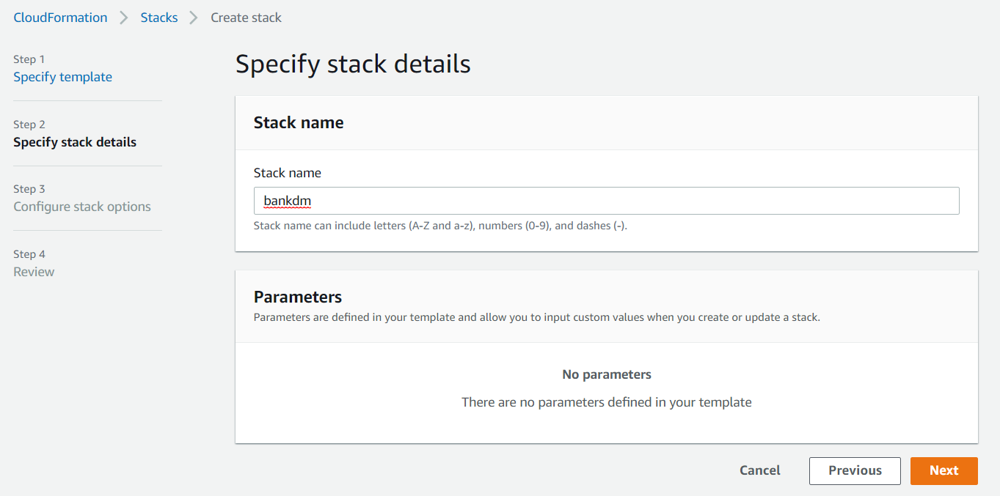

- Scroll down all the way and click `Next`.

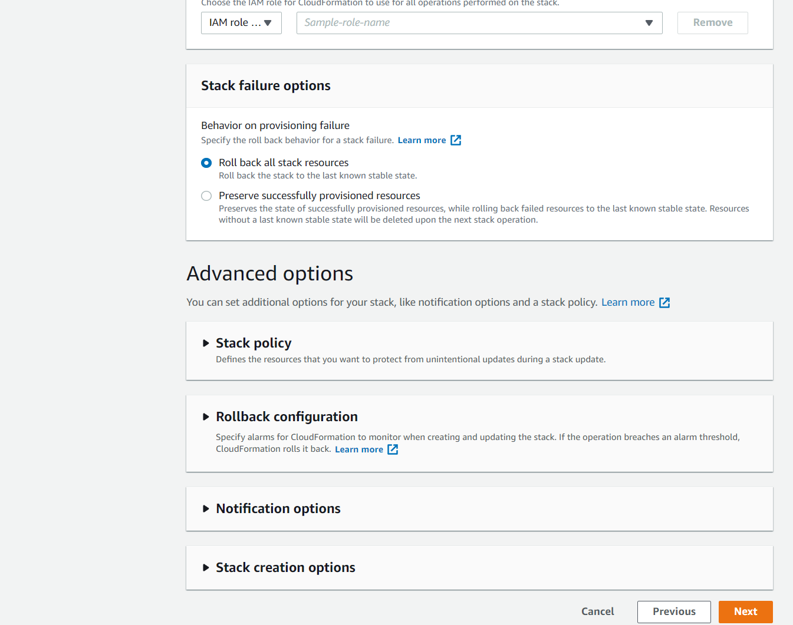

- Scroll down all the way. Check the box `I acknowledge ...` and click `Next`.

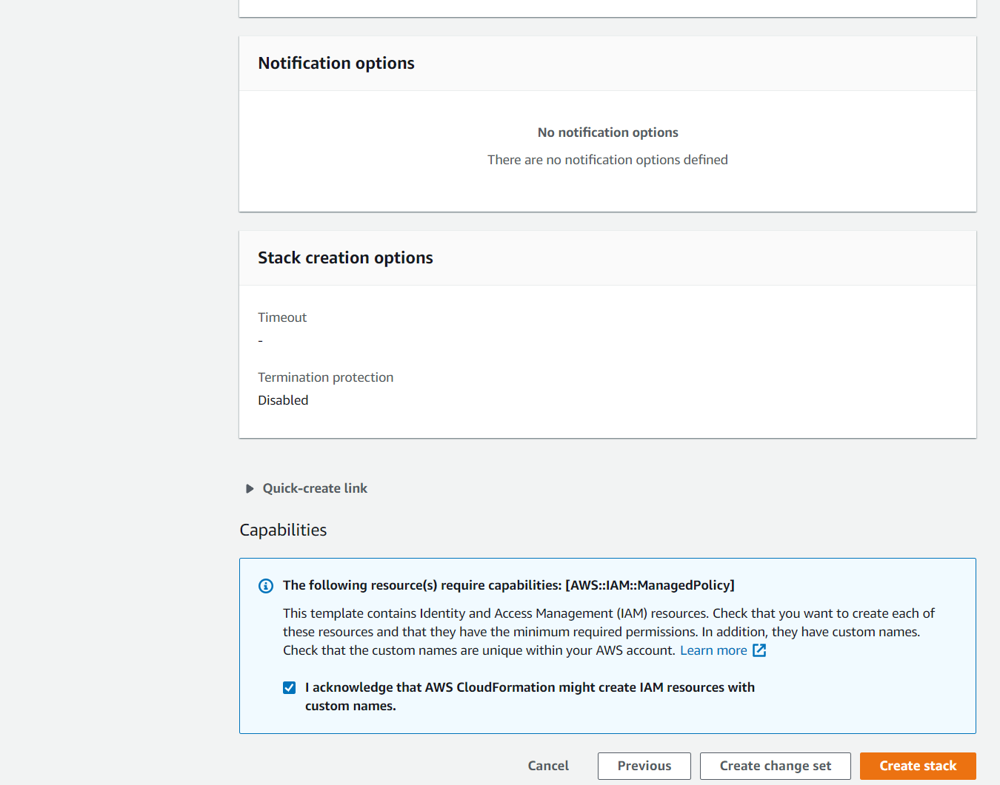

- After a few minutes, the status should show `CREATE_COMPLETE`.

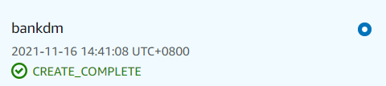


---

## Launch SageMaker Studio
- In your AWS management console, go to SageMaker.
- On the left side, under `SageMaker Domain`, click on `Studio`.
- Under `Domain` then under `Projects`, check if both options does not show green tick like the screenshot below:

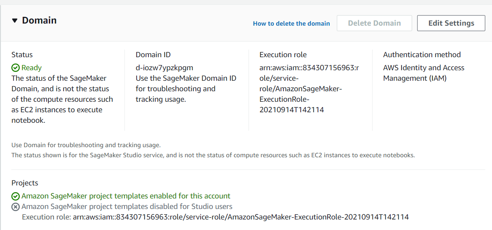

- If there is no green tick for BOTH, click on `Edit Settings`.
- Click `Next`.

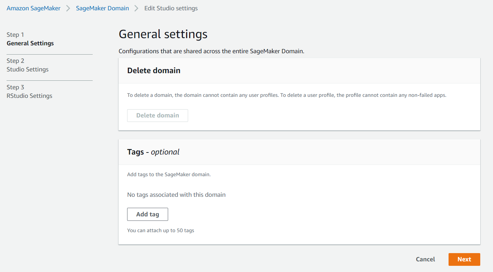

- Under `SageMaker Projects and JumpStart`, ensure both options are enabled.
- Click `Next`.


- Click `Submit`.
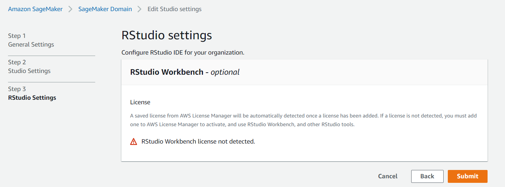

- Ensure both options show a green tick.

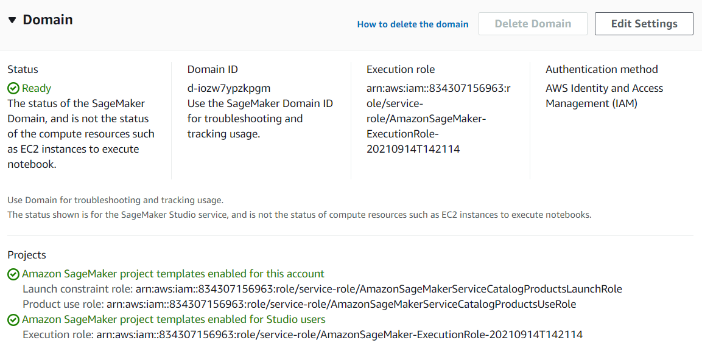

- Under `Users`, click `Launch app`, then click `Studio`.

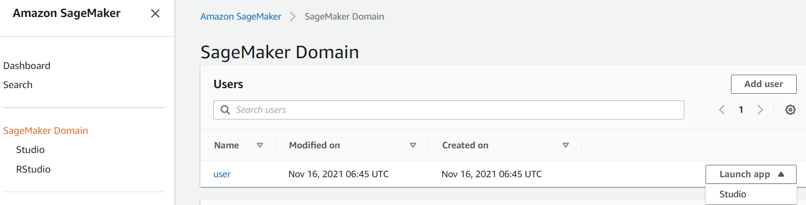

---

## SageMaker Studio
- After a short while, you will be presented with the following screen.


- On the left side, click on the second icon and click on `Clone a Repository`. 


- Enter the git clone URL of this repo (e.g. `https://github.com/laikw/bankdm-build.git`) and click `CLONE`.


- On the left side, click on the last icon. At the menu box, select `Projects` if it is not selected.


- Click on `Create project`. A new window should pop up on the right side.
- Select the `MLOps template for model building, training and deployment` and click `Select project template`.


- Enter a name for the project (e.g. BankDM) and click `Create project`. 


- After a while, the project is created.
- Click on the first `clone repo...` to clone the modelbuild repo.


- Click on `Clone Repository` to clone the repo to the SageMaker Studio.


- Click on the second `clone repo...` and click `Clone Repository`.


- The window should look like this.


- Click on the `Local path` link beside the modelbuild repo (first repo in the list). This will bring you to the directory.


- Select all the files, right click and click `Delete`.


- Go to the repo that was clone earlier (`bankdm-build` in my case). 
- Select all the files, right click and click `Cut`. SageMaker Studio does not allow you to copy folders but cut is ok.


- On the right side, if the BankDM screen is still open, you can click on the `Local path` link beside the modelbuild repo. This will bring you to the modelbuild repo directory. If not, manually navigate to the modelbuild repo directory.


- Right click and click `Paste`.
- The files will be moved here. Do not navigate away from this folder. Note that the files in your directory may differ from the screenshot.


- On the left side, click on the second icon. Scroll your mouse to the right of `Changed`, select the `+` to track all files. Repeat the same for `Untracked`.


- Your window should look like this where there are no files under `Changed` and `Untracked`. The number of files shown may differ from yours.
- Enter a commit message (commit in the screenshot) and click `Commit`.


- Enter your name, email and click `OK`.


- Click on the icon with an up arrow to push the changes. This icon is above the green line in the screenshot.


- You will get the following message.


- On the right side of the screen, click on `Pipelines` tab and double click on the Pipelines shown (`BankDM-p-7cj6qm9kexri` in the screenshot).


- The pipeline should automatically run after a short while as you push new codes. Do note that this pipeline will fail as you have not setup RedShift.


# This concludes setting up SageMaker Studio. You can now proceed to run notebook 01.


```python

```
